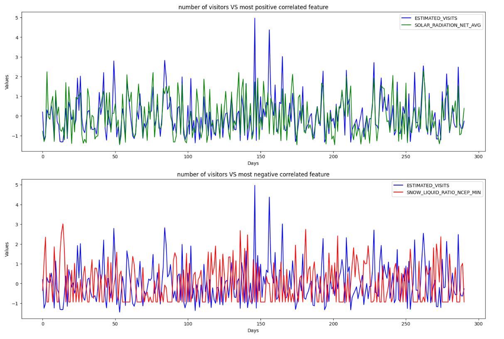

# Park Visits Prediction Using Linear Regression

## Description

This project involves building a linear regression model to predict the number of visitors to a park based on various weather conditions. The dataset comprises 167 features, including different weather parameters recorded over time. The primary objective is to perform time series analysis and feature selection to develop an accurate predictive model.

## Table of Contents

- [Installation](#installation)
- [Usage](#usage)
- [Dataset Description](#dataset-description)
- [Feature Selection](#feature-selection)
- [Model Training](#model-training)
- [Results](#results)
- [Contributing](#contributing)
- [License](#license)
- [Contact](#contact)

## Installation

To run this project, ensure you have Python installed on your system. Follow these steps to set up the environment:

1. Clone the repository:
    ```bash
    git clone https://github.com/ShayanHodai/park-visitation.git
    cd park-visitation
    ```

2. Create a virtual environment and activate it:
    ```bash
    run ./env.sh # It creates a virtual environment and installs required packages. # for ubuntu 20.04
    source venv/bin/activate  
    ```

## Usage

To run the project:
jupyter-lab park\ visitation.ipynb 

## Dataset Description

The dataset contains weather data and the number of visitors to a park over different days. It includes 167 features such as temperature, humidity, wind speed, and more. The data is structured as follows:


- `DATE_CALENDAR`: The date of record
- `ESTIMATED_VISITS`: The number of visitors to the park

Visitors distribuation


Number of visitors over time


The final dataset used in this project is created by joining two separate datasets: one containing weather data and the other containing the number of visitors to a park over different days. This merged dataset includes a total of 167 features, such as temperature, humidity, wind speed, and other weather parameters recorded over time
The weather data and park visit data were combined based on the date to create a comprehensive dataset for time series analysis and predictive modeling. The merged dataset is the result of `weather.csv` joining the `visitation.csv`

## Feature Selection

Given the high dimensionality of the dataset with 167 features, feature selection is a crucial step. I employ various techniques to identify the most significant features that contribute to the prediction accuracy. The methods used include:

- Correlation Analysis: Identifying and removing highly correlated features to reduce multicollinearity.


number of visitors VS most positive correlated feature and most negative correlated feature


 **FINDINGS!**
 
People visit the park a lot more on sunny days! 

And people are reluctant to go for a walk when it's windy, rainy, and snowy.

## Model Training

The linear regression model is trained using the selected features from the feature selection step. The training process includes:

1. Splitting the dataset into training and testing sets.
2. Normalizing the data.
3. Training the linear regression model.
4. Hyperparameter tuning to optimize the model performance.


## Results

The results of the model training and evaluation are documented in the `results` directory. This includes:

- Model performance metrics (RMSE)
- Plots of predicted vs actual values
- Feature importance analysis

Actual number of visitors vs predicted number of visitors on the test set


Prediction for the other days:


 **FINDINGS!**
 
The 11th of May, a perfect spring day with lots of sunshine, brings people to enjoy walking, playing, laughing, and spending time with puppies

08th of January, it's cold! 

## Contributing

Contributions to this project are welcome. To contribute, follow these steps:

1. Fork the repository.
2. Create a new branch (`git checkout -b feature-branch`).
3. Make your changes and commit them (`git commit -m 'Add new feature'`).
4. Push to the branch (`git push origin feature-branch`).
5. Create a new Pull Request.

Please ensure your code adheres to the project's coding standards and includes

## License

This project is licensed under the MIT License. See the [LICENSE](LICENSE) file for more details.

## Contact

For any questions or suggestions, please contact:
shayan.hodai@gmail.com
